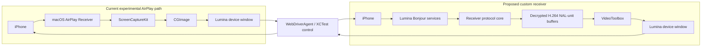

# Custom AirPlay Receiver Architecture

Status: advertisement milestone verified on a physical iPhone; receiver-core selection remains blocked on licensing and authenticated-stream validation.

Last reviewed: 20 July 2026.

## Executive decision

Lumina's current AirPlay option is not a custom receiver. It asks the iPhone to mirror to macOS's built-in AirPlay Receiver, captures Apple's full-screen receiver with ScreenCaptureKit, and relays those frames into Lumina. That explains the full-screen transition, Screen Recording prompt, and fragile window detection.

The proposed replacement is a Lumina-owned receiver that advertises `Lumina – <Mac name>`, accepts the AirPlay control and mirror streams directly, decodes H.264 with Apple frameworks, and renders into Lumina's device-sized window. The existing WebDriverAgent/XCTest connection remains a separate control channel.

This is a new network protocol and media subsystem, not a refinement of `AirPlayCaptureService`. It must remain outside the production app until all of these gates pass:

1. A separate advertisement-only proof appears in the real iPhone's Screen Mirroring list.
2. A pinned receiver core completes discovery, authentication, setup, and H.264 mirroring from the test iPhone running iOS 26.1.
3. A 30-minute physical-device run survives rotation, disconnect, reconnect, sleep/wake, and source switching.
4. The receiver-core licensing choice is compatible with Lumina's distribution model.
5. The parser and network-facing code complete a security review and fuzzing pass.

Until then, the production target and its current Direct/AirPlay behavior remain unchanged.

### Advertisement milestone result

Gate 1 passed on 20 July 2026 using the physical iPhone 15 Plus running iOS 26.1:

- the standalone proof published both `_airplay._tcp` and `_raop._tcp`, and `dns-sd` resolved their shared listener port and expected TXT records;
- Screen Mirroring listed Apple's native Mac receiver and `Lumina – <Mac name>` as two distinct destinations;
- selecting the Lumina destination reached the bounded proof listener and produced the expected “Unable to connect” result after the listener returned `501 Not Implemented`;
- the native macOS AirPlay Receiver and Screen Recording permission were not used;
- stopping the proof removed its advertisements.

This proves only receiver identity, discovery, and first-request routing. Pairing, FairPlay setup, encrypted media transport, H.264 delivery, decoding, rendering, audio, performance, and reliability are still unimplemented and unproven.

## Build, test, and measurement baseline

The verified baseline before this design work is intentionally limited to results that were actually collected:

- The macOS application built successfully with Xcode 26.1.1 for the `platform=macOS,arch=arm64` destination.
- All tests in the `LuminaTests` and `LuminaUITests` targets passed under the `Lumina` scheme.
- The repository contained no RTSP listener, AirPlay service publisher, pairing implementation, FairPlay setup, RTP/mirror parser, H.264 parser, VideoToolbox decoder, or custom AirPlay renderer.

The build and test commands used isolated Derived Data directories:

```sh
xcodebuild -quiet -project Lumina.xcodeproj -scheme Lumina -configuration Debug \
  -destination 'platform=macOS,arch=arm64' \
  -derivedDataPath /tmp/LuminaCustomReceiverBaselineBuild build

xcodebuild -quiet -project Lumina.xcodeproj -scheme Lumina -configuration Debug \
  -destination 'platform=macOS,arch=arm64' \
  -derivedDataPath /tmp/LuminaCustomReceiverBaselineTests test
```

The requested runtime measurements were not collected during this inspection and must not be inferred from UI labels or upstream projects:

| Baseline item | Result | Reason |
| --- | --- | --- |
| Display FPS | Not measured | No presented-frame instrumentation exists. |
| Screenshot FPS | Not benchmarked | The fallback targets a 200 ms loop, but request cadence is not presentation throughput. |
| Input latency | Not measured | Commands have no end-to-end latency instrumentation. |
| CPU use | Not measured | No controlled workload sample was recorded. |
| Resident memory | Not measured | No controlled workload or soak sample was recorded. |
| USB behavior | Implementation inspected; not benchmarked in this pass | The working Apple-device transport was preserved. |
| Paired Wi-Fi behavior | Implementation inspected; not benchmarked in this pass | The working Apple-device transport was preserved. |

The current UI FPS counter counts accepted frames in a rolling one-second window. It does not measure frames actually presented, sender cadence, latency, bitrate, CPU use, or memory use.

## Current and target topology



The video and control sessions have independent state. Losing AirPlay video must not destroy a healthy XCTest session, and losing XCTest control must not silently present the video as interactive.

## Repository audit

### 1. How video is obtained today

Direct mode opens WebDriverAgent's MJPEG endpoint on port 9100. JPEG frames are decoded with ImageIO, with a latest-frame-only buffer. If MJPEG fails, Lumina polls WebDriverAgent's `/screenshot` endpoint at approximately five requests per second.

AirPlay mode browses for the Mac's native `_airplay._tcp` service, identifies an Apple-owned `ControlCenter` or `AirPlayUIAgent` window, and captures it using ScreenCaptureKit. Captured BGRA pixel buffers are converted through Core Image to a `CGImage` for SwiftUI.

There is no H.264 video path in Lumina today.

### 2. How mouse/touch input is sent today

The device window maps a click to a WebDriverAgent tap and a drag to a WebDriverAgent drag. Lumina's reviewed WebDriverAgent patch exposes overlay-safe global routes backed by XCTest. Home, volume, lock/wake, orientation, health, and device-screen metadata also use that independent session.

The current gesture surface exposes single tap and one continuous drag. Double tap, long press, scrolling, multi-touch, and app activation are not yet implemented.

### 3. Whether keyboard input uses WebDriverAgent

It does not. Lumina has no keyboard transport today. Upstream WebDriverAgent contains element typing support, but Lumina neither exposes nor calls it.

### 4. Best implementation path

The best technical prototype path is a pinned [UxPlay](https://github.com/FDH2/UxPlay) receiver core behind a narrow C/Objective-C++ adapter, because it is maintained, has the most complete reviewed legacy-protocol mirroring coverage, and runs on macOS/Apple silicon. It is not yet the approved production path because UxPlay is GPLv3 and Lumina is MIT. There is no reviewed candidate that is both the best technical fit and compatible with distributing Lumina as MIT-only. See the dependency review before using any receiver code.

The architecture must therefore support interchangeable receiver cores:

```swift
protocol AirPlayReceiverCore: Sendable {
    func start(configuration: ReceiverConfiguration) async throws
    func stop() async
    var events: AsyncStream<ReceiverEvent> { get }
}
```

The concrete implementation can later be:

- a GPLv3-compatible UxPlay integration after an explicit licensing decision;
- a separately licensed commercial/MFi implementation;
- or a clean-room implementation developed from authorized specifications and independently observed interoperability behavior.

### 5. Apple-silicon support

Yes for the technical prototype. UxPlay documents macOS support on Intel and Apple silicon, and [AirCapture](https://github.com/libardoram/AirCapture) provides source-level evidence of an Apple-silicon macOS wrapper that sends UxPlay's video callback into VideoToolbox. Lumina has not independently run or validated AirCapture. It is architecture evidence, not a production dependency: it is GPLv3 and was a very small, young repository when reviewed.

### 6. H.264 output into a custom `NSView`

Yes. UxPlay's callback supplies a buffer containing one or more decrypted Annex-B H.264 NAL units, not a guaranteed higher-level access-unit object. The adapter must copy or retain callback data before the receiver core releases it and place it in a bounded, newest-useful-frame queue.

The native pipeline is:

1. Parse the expected UxPlay Annex-B buffers into NAL units, track SPS/PPS, and assemble complete decodable samples; an independently selected core may require AVCC or another length-prefixed adapter.
2. Build `CMVideoFormatDescription` from the parameter sets.
3. Create timing-aware `CMSampleBuffer` values only after sample boundaries are known.
4. Either enqueue them into `AVSampleBufferDisplayLayer` or decode with `VTDecompressionSession` into `CVPixelBuffer` objects and render with Metal/Core Animation.
5. Flush and rebuild the decoder when codec parameter sets, format description, or encoded dimensions change. An orientation-only change updates the content transform without rebuilding a compatible decoder.
6. Drop stale frames under backpressure and resume on an IDR frame.

For the first receiver window, `AVSampleBufferDisplayLayer` is the smallest appropriate renderer. A Metal renderer is justified only if privacy effects, color conversion, overlays, or precise presentation telemetry require it.

### 7. C/C++ responsibility

If UxPlay is selected, C/C++ owns only the protocol core:

- RTSP/HTTP parsing and request routing;
- pair setup and verification;
- FairPlay setup and stream-key handling;
- binary property-list interop;
- timing, event, audio, and mirror sockets;
- encrypted mirror framing, AES state, and H.264 NAL-unit extraction;
- bounded validation of every network length and field.

It must not own Lumina windows, setup UI, XCTest state, source selection, or application lifecycle.

### 8. Swift responsibility

Swift owns:

- receiver configuration and persistent identity access;
- lifecycle and state machines;
- the C/Objective-C++ adapter boundary;
- VideoToolbox and the normal device-sized `NSWindow` renderer;
- source selection, recovery, and user-facing diagnostics;
- XCTest/WDA control and coordinate mapping;
- structured metrics and signposts;
- privacy blur and overlays;
- sandbox, signing, and local-network permission presentation.

### 9. Bonjour services and TXT records

The advertisement-only proof publishes the same control port under both DNS-SD service types. The keys and conservative legacy-mirroring profile below are derived from current UxPlay and the [unofficial AirPlay service-discovery documentation](https://openairplay.github.io/airplay-spec/service_discovery.html). Lumina intentionally uses a generated, per-install persistent pairing identifier for `pi`; reviewed UxPlay uses the fixed value `2e388006-13ba-4041-9a67-25dd4a43d536`. These are experimental interoperability inputs, not a claim of protocol support.

`_airplay._tcp`, instance `Lumina – <Mac name>`:

| Key | Value |
| --- | --- |
| `deviceid` | Persistent colon-separated six-byte receiver ID |
| `features` | `0x5A7FFEE6,0x0` |
| `pw` | `false` |
| `flags` | `0x4` |
| `model` | `AppleTV3,2` |
| `pk` | Persistent Ed25519 public key, lowercase hexadecimal |
| `pi` | Lumina's generated, per-install persistent receiver pairing identifier |
| `srcvers` | `220.68` |
| `vv` | `2` |

`_raop._tcp`, instance `<UPPERCASE_ID_WITHOUT_SEPARATORS>@Lumina – <Mac name>`:

| Key | Value |
| --- | --- |
| `ch` | `2` |
| `cn` | `0,1,2,3` |
| `da` | `true` |
| `et` | `0,3,5` |
| `vv` | `2` |
| `ft` | `0x5A7FFEE6,0x0` |
| `am` | `AppleTV3,2` |
| `md` | `0,1,2` |
| `rhd` | `5.6.0.0` |
| `pw` | `false` |
| `sf` | `0x4` |
| `sr` | `44100` |
| `ss` | `16` |
| `sv` | `false` |
| `tp` | `UDP` |
| `txtvers` | `1` |
| `vs` | `220.68` |
| `vn` | `65537` |
| `pk` | The same persistent public key |

Each DNS-SD service-instance label is limited to 63 UTF-8 bytes. The `_airplay._tcp` name may use that full budget, but the `_raop._tcp` name must reserve 13 bytes for the twelve-character compact device ID and `@`. Name construction must truncate on character boundaries using the byte budget for the complete label, not truncate the friendly name first and then prepend the RAOP identifier.

The `_raop._tcp` `tp=UDP` value describes the advertised RAOP audio transport profile. It does not mean the screen-mirroring video arrives as UDP; the reviewed legacy mirroring flow negotiates a separate TCP mirror data port.

Apple requires local-network permission for Bonjour operations and requires used service types in `NSBonjourServices`; see [TN3179](https://developer.apple.com/documentation/technotes/tn3179-understanding-local-network-privacy) and [TN3151](https://developer.apple.com/documentation/technotes/tn3151-choosing-the-right-networking-api).

### 10. Authentication and stream setup

The currently observed legacy flow is:

1. The sender discovers the AirPlay and RAOP records and opens the RTSP/control connection.
2. Initial and full `GET /info` exchanges advertise the receiver identity, public key, features, display dimensions, refresh rate, and media capabilities.
3. `POST /pair-setup` returns the persistent Ed25519 public key.
4. The two-stage `/pair-verify` exchange uses an ephemeral X25519 shared secret, receiver/client Ed25519 signatures, and an encrypted signature payload.
5. `/fp-setup` performs the FairPlay SAP exchange.
6. The first binary-plist `SETUP` supplies encrypted key material, IV, timing port, and sender metadata. The receiver derives the session key and starts timing/event services.
7. `RECORD` starts media delivery.
8. A stream `SETUP` with mirror type 110 supplies the stream connection identifier. The receiver returns a separate mirror data port.
9. The mirror TCP connection carries fixed headers followed by codec configuration or encrypted video payloads. Extracted H.264 NAL units are length-prefixed on this wire path.
10. Feedback, timing, teardown, and reconnect messages maintain the session.

This flow is reverse-engineered behavior, not an Apple-supported public contract. Exact iOS 26.1 behavior must be captured and validated against the physical test device before implementation claims are made.

### 11. Current-iOS discover/connect status

Discovery and first-request routing are proven for Lumina's standalone advertisement target on this Mac and the physical iPhone 15 Plus running iOS 26.1. Authenticated connection and media reception are not proven. The separate upstream evidence is a report of UxPlay 1.72.2 receiving iPadOS 26.1 through WSL/Linux; it is not proof for this Mac, this iPhone, or the pinned receiver revision. There is also a reported iOS 27 beta protocol change. The proof target therefore stops at the first request with an explicit unsupported response rather than treating Bonjour visibility as a working media receiver.

### 12. BLE HID keyboard feasibility

A later, isolated BLE keyboard proof is technically credible using public `CBPeripheralManager` APIs and the standard HID-over-GATT profile. The reviewed `darwin-bt-remote` source and its published application report this behavior with the full 128-bit Bluetooth SIG HID UUID; Lumina has not independently validated it. The project reports that current macOS rejects the equivalent short `1812` form. Apple does not document that representation workaround, so it is a compatibility experiment, not a guaranteed platform contract.

Lumina should keep WDA for absolute touch and gestures. A BLE mouse is relative, requires iPhone pointer/AssistiveTouch behavior, and is not a replacement for screen-coordinate taps. Bluetooth Classic does not provide the normal inbound, host-initiated HID-peripheral flow on macOS because `bluetoothd` owns the HID L2CAP ports. Current experimental code can initiate outbound IOBluetooth HIDP connections to a limited set of target stacks, but that path uses deprecated IOBluetooth APIs and, in the reviewed example, a private KVC getter. It is not the preferred release path.

No Bluetooth code belongs in the AirPlay receiver proof.

### 13. License consequences

The dependency report contains the full matrix. The decisive facts are:

- Lumina: MIT.
- WebDriverAgent: BSD, already acknowledged.
- UxPlay and its PlayFair component: GPLv3.
- AirCapture: GPLv3 because it links UxPlay.
- `darwin-bt-remote`: AGPLv3-only or commercial license.
- Apple's supported accessory specifications and certification resources are available through the MFi program; Apple's public MFi page lists AirPlay audio among licensed technologies.

Linking or copying GPLv3 receiver code into a distributed MIT-only Lumina build is not approved. A separate process is not automatically a license exception when it is designed as a tightly coupled component. The project needs a deliberate open-source license decision, a separate commercial license, an authorized implementation path, or qualified legal advice before distribution.

## Proposed component boundaries

```text
AirPlayReceiverCoordinator (Swift actor)
├── ReceiverIdentityStore (Keychain)
├── BonjourAdvertisement
├── ReceiverCoreAdapter (C/Objective-C++ boundary)
│   ├── RTSP / pairing / FairPlay / mirror transport
│   └── bounded compressed-frame callback
├── H264Decoder (VideoToolbox)
├── DeviceVideoRenderer (AppKit / AVFoundation)
├── ReceiverMetrics
└── ReceiverDiagnostics

AutomationWorkspaceModel
├── VisualSession: direct | customAirPlay
└── ControlSession: WebDriverAgent / XCTest
```

`AirPlayReceiverCoordinator` must not depend on `AutomationWorkspaceModel`. The workspace coordinates the two sessions, but either one can start, fail, or recover independently.

## State model

```text
stopped
  → advertising
  → senderConnected
  → authenticating
  → configuringStreams
  → receivingVideo
  → stopping
  → stopped

Any active state
  → failed(recoverable | terminal)
  → advertising or stopped
```

Separately expose:

- video state;
- control state;
- advertised receiver identity;
- connected sender identity, redacted in normal logs;
- codec, dimensions, orientation, and content rectangle;
- whether the displayed frame is fresh;
- the last recoverable failure and a reconnect action.

## Coordinate mapping

Touch mapping must use the actual visible video rectangle, not the outer window:

1. Convert the AppKit event from backing coordinates into the renderer's content rectangle.
2. Reject points outside that rectangle; do not clamp gutter clicks onto the iPhone edge.
3. Normalize within the content rectangle.
4. Apply the confirmed device-orientation transform, including the difference between landscape left and landscape right.
5. Scale to the WDA logical screen size.
6. Send the command through the independent control session.

Tests must cover portrait, both landscape directions, letterboxing, backing scale, dynamic resolution, zoom, and rotation during an active gesture.

## Reliability and security requirements

The receiver is an unauthenticated local-network attack surface before pairing. Production acceptance requires:

- strict maximum lengths for request lines, headers, bodies, plist objects, mirror packets, NAL units, and aggregate frame queues;
- request deadlines and idle timeouts;
- no force unwraps or unchecked integer conversions in the network parser;
- fuzz tests for HTTP/RTSP, plist, mirror headers, and codec configuration;
- bounded newest-frame queues and cancellation-safe teardown;
- encrypted private receiver identity in Keychain;
- log redaction for sender IDs, addresses, keys, pairing material, and device names;
- App Sandbox network entitlements where compatible with the chosen receiver core;
- an explicit interface and peer policy: advertise only in the local domain, reject non-local peer endpoints, and do not assume Bonjour publication makes an `NWListener` on `.any` local-only;
- no Screen Recording permission for the custom receiver path;
- a clear warning that protected DRM video is unsupported;
- a source fallback that never silently changes privacy or licensing behavior.

## Measurement plan

The proof must report measured values, never profile targets:

- incoming callback buffers and parsed NAL units per second;
- successfully decoded and actually presented frames per second;
- dropped callback buffers, NAL units, and frames by reason;
- compressed bitrate;
- network-to-present latency when sender timestamps permit it;
- click-to-WDA-response latency;
- decoder queue depth and decode duration;
- process CPU and resident memory;
- disconnect and reconnect duration.

Acceptance runs:

1. 30 minutes portrait on Wi-Fi.
2. 30 minutes with repeated scrolling and video motion.
3. Ten portrait/landscape rotations.
4. Ten sender disconnect/reconnect cycles.
5. Mac sleep/wake and iPhone Wi-Fi off/on.
6. Concurrent XCTest controls throughout.
7. Direct ↔ custom AirPlay source switching without rebuilding or reinstalling the runner.

Sixty FPS is an outcome to measure, not a promise. The sender controls frame cadence and may ignore advertised capabilities.

## Initial proof boundary

The first committed proof contains only:

- a standalone macOS target outside the production source tree;
- persistent experimental receiver identity;
- `_airplay._tcp` and `_raop._tcp` publication;
- visible advertisement status and connection logging;
- a minimal TCP listener that explicitly reports protocol negotiation as unsupported.

It contains no GPL receiver code, no FairPlay implementation, no media decoder, no production integration, and no changes to the existing AirPlay source.

## Primary references

- [UxPlay](https://github.com/FDH2/UxPlay)
- [UxPlay v1.73.6](https://github.com/FDH2/UxPlay/releases/tag/v1.73.6)
- [UxPlay iPadOS 26.1 interoperability report](https://github.com/FDH2/UxPlay/issues/480)
- [UxPlay iOS 27 beta protocol-change report](https://github.com/FDH2/UxPlay/issues/535)
- [AirCapture](https://github.com/libardoram/AirCapture)
- [darwin-bt-remote](https://github.com/jqssun/darwin-bt-remote)
- [Unofficial AirPlay service discovery](https://openairplay.github.io/airplay-spec/service_discovery.html)
- [Apple: Bonjour](https://developer.apple.com/bonjour/)
- [Apple TN3179: local network privacy](https://developer.apple.com/documentation/technotes/tn3179-understanding-local-network-privacy)
- [Apple TN3151: choosing a networking API](https://developer.apple.com/documentation/technotes/tn3151-choosing-the-right-networking-api)
- [Apple: VideoToolbox](https://developer.apple.com/documentation/videotoolbox)
- [Apple: `AVSampleBufferDisplayLayer`](https://developer.apple.com/documentation/avfoundation/avsamplebufferdisplaylayer)
- [Apple: Core Bluetooth peripheral role](https://developer.apple.com/library/archive/documentation/NetworkingInternetWeb/Conceptual/CoreBluetooth_concepts/PerformingCommonPeripheralRoleTasks/PerformingCommonPeripheralRoleTasks.html)
- [Bluetooth SIG: HID over GATT](https://www.bluetooth.com/specifications/specs/hid-over-gatt-profile/)
- [Apple MFi program](https://mfi.apple.com/en/how-it-works.html)
