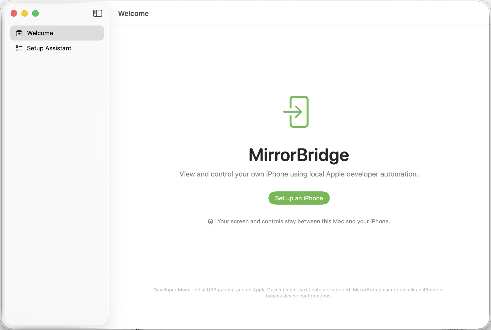
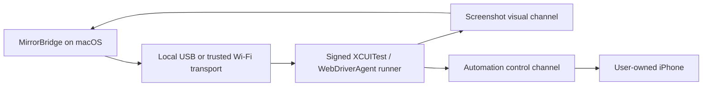

# MirrorBridge

<p align="center">
  <strong>A local-first native macOS foundation for viewing and controlling your own iPhone through Apple developer automation.</strong>
</p>

<p align="center">
  
  
  
  
</p>

<picture>
  <source media="(prefers-color-scheme: dark)" srcset="Documentation/Images/mirrorbridge-welcome-dark.png">
  <source media="(prefers-color-scheme: light)" srcset="Documentation/Images/mirrorbridge-welcome-light.png">
  
</picture>

> [!IMPORTANT]
> MirrorBridge is in early development. The app can inspect the Mac developer environment and discover a connected physical iPhone using structured Apple tooling. It does **not yet build WebDriverAgent, install an automation runner, mirror a screen, or send control commands**.

## What MirrorBridge is

MirrorBridge is intended to become a native macOS utility for a user to view and control their own non-jailbroken iPhone without a cloud backend. The design uses supported or demonstrably working Apple developer mechanisms and does not pretend that an ordinary iOS application can control other applications.

The eventual system has two independent channels:

- **Visual channel:** begins with repeated WebDriverAgent screenshots. Faster sources can be added only when backed by a genuine local capture mechanism.
- **Control channel:** sends taps, drags, swipes, typing, and supported device actions through a signed XCUITest/WebDriverAgent runner.



Video frames, commands, device details, and diagnostics are designed to remain on the user's Mac and iPhone. No cloud relay, account, analytics service, or hosted database is planned for core operation.

## Current status

### Implemented

- Native SwiftUI macOS application targeting macOS 14+
- Swift 6 language mode and strict concurrency boundaries
- Welcome experience and privacy messaging
- Nine-step setup-assistant shell with honest phase labels
- Explicit workflow state machine with guarded transitions
- User-facing state explanations, actions, recovery flags, diagnostics, and progress
- Protocol-based dependency container
- Structured OSLog categories
- Hardened Runtime enabled; App Sandbox is disabled because it blocks Xcode and CoreDevice command-line services required for local device development
- Unit tests for state transitions and presentation metadata
- Light and dark appearance launch coverage
- Real macOS, architecture, and disk-space checks
- Real Xcode version, selected developer directory, first-launch/license, and Command Line Tools checks
- Structured physical-device iOS SDK discovery through `xcodebuild -showsdks -json`
- Local Apple Development identity, private-key, team, and validity inspection through Security.framework
- Cancellable, bounded async process execution without shell command construction
- Actionable environment results and remediation in the setup assistant
- Structured physical-iPhone discovery by merging `devicectl` and `xcdevice` results
- Real USB connection, pairing, Developer Mode, current lock, and network-tunnel status
- Partially redacted device identifiers and continuous connection-change monitoring with bounded backoff
- Trust, unlock, and Developer Mode guidance that preserves required on-device confirmations

### Planned

- Pinned, licensed WebDriverAgent integration
- Runner signing, building, installation, and launch
- Loopback-only USB transport and trusted Wi-Fi reconnection
- Typed WebDriverAgent client and automation session management
- Screenshot mirroring with bounded buffers and adaptive polling
- Coordinate mapping, mouse gestures, trackpad input, and keyboard input
- Recovery, redacted diagnostics, and release packaging

## Requirements

To build the current macOS foundation:

- macOS 14 or newer
- Xcode with the macOS SDK installed
- Git

Physical-device discovery and future automation require:

- A personally owned, compatible iPhone
- Initial USB connection and trust pairing
- Developer Mode enabled on the iPhone
- Xcode with the matching iOS platform installed
- An Apple Development certificate and signing team
- Periodic runner rebuilding or re-signing, especially with a free personal team

MirrorBridge will never bypass passcodes, Face ID, Touch ID, Activation Lock, device trust, or Developer Mode confirmations.

## Install from source

There is no downloadable release build yet. Build the development version from Xcode:

```bash
git clone https://github.com/ipixeldev/Lumina.git
cd Lumina
open Lumina.xcodeproj
```

In Xcode:

1. Select the `Lumina` project.
2. Select the `Lumina` application target.
3. Open **Signing & Capabilities**.
4. Select your own development team if Xcode requires signing.
5. Choose **My Mac** as the run destination.
6. Press **Run** or use `⌘R`.

The Xcode project and scheme retain the historical name `Lumina`; the built product, executable, bundle display name, and Swift module are `MirrorBridge`.

### Command-line build

For a local unsigned verification build:

```bash
xcodebuild \
  -project Lumina.xcodeproj \
  -scheme Lumina \
  -configuration Debug \
  -destination 'platform=macOS' \
  -derivedDataPath /tmp/MirrorBridgeDerivedData \
  CODE_SIGNING_ALLOWED=NO \
  build
```

The app will be written to:

```text
/tmp/MirrorBridgeDerivedData/Build/Products/Debug/MirrorBridge.app
```

## Run the tests

Run the unit tests without requiring a signing identity:

```bash
xcodebuild \
  -project Lumina.xcodeproj \
  -scheme Lumina \
  -configuration Debug \
  -destination 'platform=macOS' \
  -derivedDataPath /tmp/MirrorBridgeTestData \
  CODE_SIGNING_ALLOWED=NO \
  -only-testing:LuminaTests \
  test
```

UI tests require a local development signing identity in some Xcode configurations.

## How the code is organized

```text
Lumina/
├── Application/          App entry point, navigation, dependencies
├── Domain/               Workflow states, devices, transition rules
├── DeviceManagement/     Apple-tool discovery and connection monitoring
├── DeveloperEnvironment/ Mac, Xcode, SDK, and signing checks
├── Diagnostics/          Structured local logging
├── UI/
│   ├── Welcome/
│   └── SetupAssistant/
└── Assets.xcassets/
LuminaTests/               Swift Testing unit and structured-fixture tests
LuminaUITests/             XCUITest app and opt-in physical-device coverage
Documentation/Images/      README screenshots
```

Folders for automation, transport, mirroring, input, and security will be introduced only when they contain real, tested implementations.

## Security and privacy principles

- Core operation stays local between the Mac and paired iPhone.
- No analytics, tracking SDK, advertising SDK, or remote logging.
- No cloud video or remote internet control.
- Local proxy endpoints bind to loopback unless a verified design requires otherwise.
- Typed text and clipboard content must never be logged.
- Device identifiers, user paths, certificates, and exported diagnostics must be redacted.
- Helpers must be versioned, signed, licensed, integrity checked, and narrowly scoped.
- No jailbreak, private touch-injection API, passcode bypass, or hidden surveillance behavior.

## Platform limitations

The finished product will still be constrained by Apple's developer automation system:

- Developer Mode and an Apple Development certificate are required.
- Initial USB pairing and on-device trust confirmation are normally required.
- The iPhone may need to remain unlocked.
- XCTest runners can expire or stop after Xcode/iOS changes.
- Free development signing typically needs more frequent renewal.
- Some secure, banking, authentication, DRM, or system interfaces may resist automation or capture.
- Screenshot streaming is lower frame rate than Apple's built-in iPhone Mirroring.
- MirrorBridge cannot bypass passcodes, biometrics, Activation Lock, or physical confirmations.
- Compatibility will vary across Xcode, iOS, device models, and the selected WebDriverAgent version.

## Contributing

Contributions are welcome once the repository has an explicit open-source license.

1. Select a focused issue that can be implemented and verified independently.
2. Fork the repository and create a focused branch.
3. Keep visual and control channels separate.
4. Do not add fake production implementations, private Apple APIs, hard-coded signing data, or unsupported capability claims.
5. Add tests appropriate to the change.
6. Run the relevant build and test commands.
7. Open a pull request describing what was verified in mocks, simulators, and physical devices.

Physical-device behavior must not be described as working until it has been tested on a real iPhone.

## WebDriverAgent and third-party code

WebDriverAgent is not currently vendored or downloaded by this repository. Before integration, the project will select a maintained upstream, pin an exact revision, verify its license, preserve notices, document used routes, and keep modifications in an identified patch or fork location.

MirrorBridge is not affiliated with or endorsed by Apple. Apple, macOS, iPhone, Xcode, and related marks belong to Apple Inc.

## License

An open-source license has not been selected yet. Until a `LICENSE` file is added, the repository is publicly readable but does not grant permission to copy, modify, or redistribute the code.

The project owner should choose a license before accepting external contributions. Common options include permissive licenses such as MIT or Apache-2.0, or a copyleft license such as GPL-3.0.
