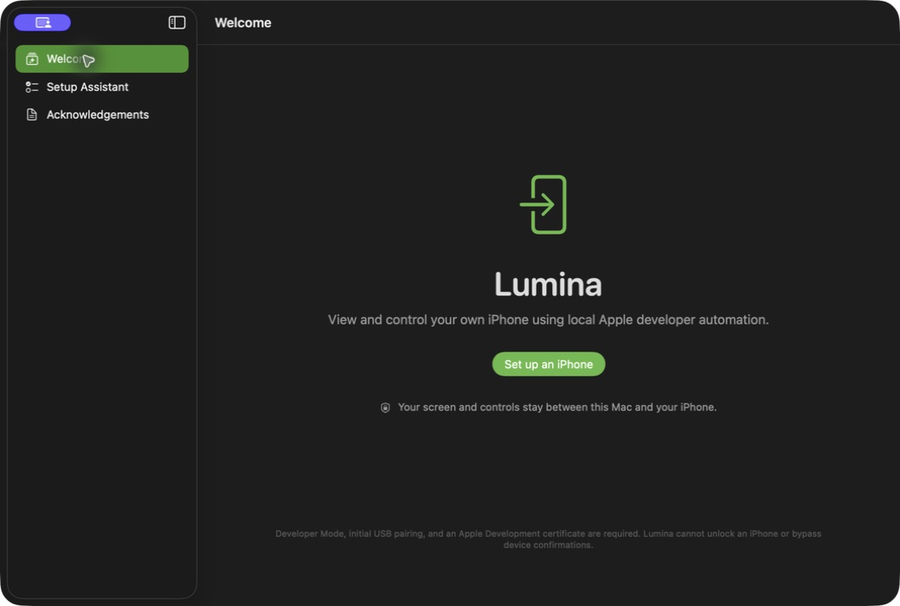
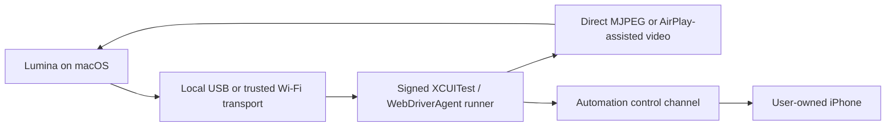
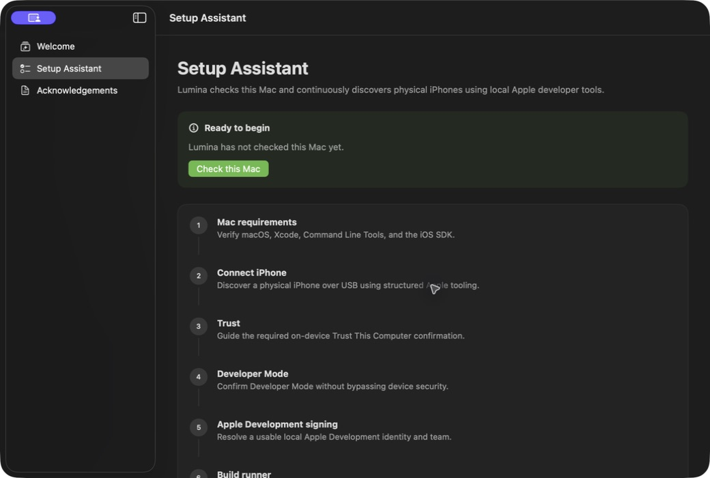

# Lumina

<p align="center">
  <strong>A local-first native macOS utility for viewing and controlling your own iPhone through Apple developer automation.</strong>
</p>



<p align="center">
  
  
  
  
</p>

> [!IMPORTANT]
> Lumina is in early development. The app can automatically prepare or reuse its local runner, establish a typed WebDriverAgent session, open a dedicated live iPhone window, and send touch and supported hardware commands. Physical-device compatibility still varies by Xcode, iOS, signing, and pairing state.

## What Lumina is

Lumina is intended to become a native macOS utility for a user to view and control their own non-jailbroken iPhone without a cloud backend. The design uses supported or demonstrably working Apple developer mechanisms and does not pretend that an ordinary iOS application can control other applications.

Lumina keeps video and input independent:

- **Visual channel:** choose the direct WebDriverAgent MJPEG stream or an experimental AirPlay-assisted ScreenCaptureKit source. Direct video has bounded screenshot polling as a compatibility fallback.
- **Control channel:** sends taps, drags, swipes, typing, and supported device actions through a signed XCUITest/WebDriverAgent runner.



Video frames, commands, device details, and diagnostics are designed to remain on the user's Mac and iPhone. No cloud relay, account, analytics service, or hosted database is planned for core operation.

## Current status

### Implemented

- Native SwiftUI macOS application targeting macOS 14+
- Swift 6 language mode and strict concurrency boundaries
- Welcome experience and privacy messaging
- Nine-step setup assistant with live capability status
- Explicit workflow state machine with guarded transitions
- User-facing state explanations, actions, recovery flags, diagnostics, and progress
- Protocol-based dependency container
- Structured OSLog categories
- Hardened Runtime enabled; App Sandbox is disabled because it blocks Xcode and CoreDevice command-line services required for local device development
- Unit tests for state transitions and presentation metadata
- Light and dark appearance launch coverage
- Real macOS, architecture, and disk-space checks
- Real Xcode version, selected developer directory, first-launch/license, and Command Line Tools checks
- Structured physical-device iOS SDK discovery through `xcodebuild -showsdks -json`
- Local Apple Development identity, private-key, team, and validity inspection through Security.framework
- Cancellable, bounded async process execution without shell command construction
- Actionable environment results and remediation in the setup assistant
- Structured physical-iPhone discovery by merging `devicectl` and `xcdevice` results
- Real USB connection, pairing, Developer Mode, current lock, and network-tunnel status
- Partially redacted device identifiers and continuous connection-change monitoring with bounded backoff
- Trust, unlock, and Developer Mode guidance that preserves required on-device confirmations
- Appium WebDriverAgent v15.1.6 pinned as a Git submodule at commit `5f8280e761dc0b5b9b28368e63a8f0cc8d868346`
- Pinned WebDriverAgent source packaged inside the app so runner builds do not require Documents-folder access
- Stable per-install runner bundle identifiers backed by a random Keychain identity
- Automatic selection of a usable Apple Development team without hard-coded signing data
- Cancellable `xcodebuild build-for-testing` with result bundles and actionable failure classification
- Local Security.framework verification of the produced runner signature, team, and identifier
- Structured runner installation through Apple's `devicectl`
- Long-lived XCTest launch with cancellation and actionable failure diagnostics
- Local WebDriverAgent endpoint discovery through trusted CoreDevice hostnames and WDA launch output
- Typed `/status` validation that rejects a stale or mismatched runner
- Typed WebDriverAgent session creation, response validation, and best-effort cleanup
- Automatic reuse of a locally cached runner after signature, team, and bundle verification
- Installed-runner detection that skips redundant installation on a previously prepared iPhone
- Automatic build, install when needed, launch, session creation, and device-window opening after the requirements check
- Dedicated local MJPEG stream with newest-frame buffering, selectable quality profiles, and screenshot fallback
- Balanced direct-video validation at 24–28 FPS on an iPhone 15 Plus, up from the previous 5 FPS polling path
- Experimental AirPlay-assisted visual source using macOS AirPlay Receiver plus Apple's ScreenCaptureKit picker, targeting native-quality capture at up to 60 Hz
- Separate iPhone window that follows the video aspect ratio without side gutters
- Device screen metadata, orientation, and active-application discovery
- Aspect-fit coordinate mapping for click-to-tap and drag-to-swipe control
- Overlay controls for Wake or Unlock, Home, local view rotation, and Volume Up
- Three-dot menu for secondary controls, measured FPS, video source, direct-stream quality, refresh, and Privacy Blur
- Reliable local view rotation with rotated touch-coordinate mapping, plus a separate best-effort device-orientation request
- One-click runner reconnection without rebuilding or reinstalling after a dropped session
- Paired Wi-Fi device discovery and launch support through Apple's CoreDevice/Xcode transport
- Bundled WebDriverAgent BSD license and native acknowledgements screen

### Planned

- Physical-device validation across supported iOS and Xcode versions
- Automatic reconnection attempts after transient Wi-Fi loss
- Adaptive quality based on measured device and network load
- Trackpad scroll, keyboard input, and configurable shortcuts
- Recovery, redacted diagnostics, and release packaging

## Requirements

To build the current macOS foundation:

- macOS 14 or newer
- Xcode with the macOS SDK installed
- Git

Physical-device discovery and future automation require:

- A personally owned, compatible iPhone
- Initial USB connection and trust pairing
- Developer Mode enabled on the iPhone
- Xcode with the matching iOS platform installed
- An Apple ID signed in under **Xcode → Settings → Accounts** so Xcode can create a device provisioning profile
- An Apple Development certificate and signing team
- Periodic runner rebuilding or re-signing, especially with a free personal team

Lumina will never bypass passcodes, Face ID, Touch ID, Activation Lock, device trust, or Developer Mode confirmations.

## Install from source

There is no downloadable release build yet. Build the development version from Xcode:

```bash
git clone --recurse-submodules https://github.com/ipixeldev/Lumina.git
cd Lumina
open Lumina.xcodeproj
```

If the repository was cloned previously, initialize the pinned WebDriverAgent source:

```bash
git submodule update --init --recursive
```

In Xcode:

1. Select the `Lumina` project.
2. Select the `Lumina` application target.
3. Open **Signing & Capabilities**.
4. Select your own development team if Xcode requires signing.
5. Choose **My Mac** as the run destination.
6. Press **Run** or use `⌘R`.

The Xcode project, target, scheme, product, executable, bundle display name, and Swift module are all named `Lumina`.

## Connect an iPhone



1. Connect the iPhone over USB, unlock it, and accept **Trust This Computer** if prompted.
2. Enable **Developer Mode** under **Settings → Privacy & Security** on the iPhone, then complete the required restart and on-device confirmation.
3. In Xcode, open **Settings → Accounts** and sign in with the Apple ID associated with your development team.
4. Open Lumina, choose **Set up an iPhone**, then select **Check this Mac**.
5. Confirm that Lumina reports the iPhone as paired, unlocked, and ready, and that Apple Development signing is ready.
6. Lumina automatically verifies and reuses a cached signed runner when possible. On the first run—or after signing/source changes—it builds a fresh runner and Xcode may contact Apple to create or refresh the provisioning profile.
7. Lumina checks whether that exact runner is already installed. It installs only when needed, then starts XCTest and creates the automation session.
8. The iPhone screen opens automatically in a separate, device-sized window. Click to tap and drag to swipe.
9. The overlay keeps Wake or Unlock, Home, Rotate View, and Volume Up immediately available. Use the three-dot menu for secondary actions, Privacy Blur, quality, video source, and measured FPS.

### Video source and quality

Lumina offers two visual sources while keeping the same local XCUITest control channel:

- **Direct** is the default. It uses WebDriverAgent's MJPEG server and works over USB or the trusted Xcode Wi-Fi tunnel.
- **AirPlay-assisted** is experimental. The iPhone mirrors to macOS's built-in AirPlay Receiver, and Lumina captures only the window or display you select through Apple's ScreenCaptureKit picker.

Direct video includes three presets:

- **Balanced:** 75% scale, up to 30 FPS. This is the default.
- **High Quality:** full scale, up to 20 FPS for text and detail.
- **Smooth:** 50% scale, up to 60 FPS where the iPhone and transport can sustain it.

These values are targets, not guaranteed delivery rates. Higher resolution increases encoding, transport, and decoding load; the FPS shown in Lumina is the measured frame rate.

To use AirPlay-assisted video:

1. On the Mac, enable **System Settings → General → AirDrop & Handoff → AirPlay Receiver**.
2. Keep the Mac and iPhone on the same Wi-Fi network.
3. On the iPhone, open Control Center, choose **Screen Mirroring**, and select the Mac.
4. In Lumina's three-dot menu, choose **Video Source → AirPlay-assisted**.
5. In the macOS picker, select the AirPlay mirrored window or display.
6. Approve Screen Recording permission if macOS requests it. macOS may require Lumina to be restarted after the first approval.

AirPlay-assisted mode does not turn Lumina itself into an AirPlay receiver. Apple does not expose a public API for third-party apps to advertise a custom receiver; Lumina deliberately uses the system receiver and public capture picker instead.

### Connect over Wi-Fi

The first pairing and runner setup should be completed over USB. For later Wi-Fi sessions:

1. Keep the Mac and iPhone on the same trusted local network with Wi-Fi enabled.
2. Confirm the iPhone remains paired and available in **Xcode → Window → Devices and Simulators**.
3. Disconnect USB. Lumina accepts the paired Wi-Fi device when Xcode/CoreDevice reports its developer tunnel as connected.
4. Open Lumina and run **Check this Mac**. The cached runner and installed app are reused; a normal Wi-Fi reconnect does not rebuild or reinstall them.

Wi-Fi transport depends on Xcode's device tunnel and local-network conditions. Initial trust, Developer Mode, and passcode prompts still require direct action on the iPhone.

Lumina reports setup failures with a diagnostic code and a specific recovery action. It never accepts trust, Developer Mode, passcode, or Apple ID prompts on the user's behalf.

### Command-line build

For a local unsigned verification build:

```bash
xcodebuild \
  -project Lumina.xcodeproj \
  -scheme Lumina \
  -configuration Debug \
  -destination 'platform=macOS' \
  -derivedDataPath /tmp/LuminaDerivedData \
  CODE_SIGNING_ALLOWED=NO \
  build
```

The app will be written to:

```text
/tmp/LuminaDerivedData/Build/Products/Debug/Lumina.app
```

## Run the tests

Run the unit tests without requiring a signing identity:

```bash
xcodebuild \
  -project Lumina.xcodeproj \
  -scheme Lumina \
  -configuration Debug \
  -destination 'platform=macOS' \
  -derivedDataPath /tmp/LuminaTestData \
  CODE_SIGNING_ALLOWED=NO \
  -only-testing:LuminaTests \
  test
```

UI tests require a local development signing identity in some Xcode configurations.

## How the code is organized

```text
Lumina/
├── Application/          App entry point, navigation, dependencies
├── Automation/           Typed WDA session, screen, and input client
├── Domain/               Workflow states, devices, transition rules
├── DeviceManagement/     Apple-tool discovery and connection monitoring
├── DeveloperEnvironment/ Mac, Xcode, SDK, and signing checks
├── RunnerManagement/     Build, signing, installation, launch, local health
├── Diagnostics/          Structured local logging
├── UI/
│   ├── Welcome/
│   ├── SetupAssistant/
│   ├── DeviceControl/
│   └── About/
└── Assets.xcassets/
LuminaTests/               Swift Testing unit and structured-fixture tests
LuminaUITests/             XCUITest app and opt-in physical-device coverage
Vendor/WebDriverAgent/      Pinned Appium WebDriverAgent submodule
```

Additional transport, mirroring, input, and security folders will be introduced only when they contain real, tested implementations.

## Security and privacy principles

- Core operation stays local between the Mac and paired iPhone.
- No analytics, tracking SDK, advertising SDK, or remote logging.
- No cloud video or remote internet control.
- Automation endpoints use loopback or trusted CoreDevice-local hostnames and are never exposed as public services.
- Typed text and clipboard content must never be logged.
- Device identifiers, user paths, certificates, and exported diagnostics must be redacted.
- Helpers must be versioned, signed, licensed, integrity checked, and narrowly scoped.
- No jailbreak, private touch-injection API, passcode bypass, or hidden surveillance behavior.

## Platform limitations

The finished product will still be constrained by Apple's developer automation system:

- Developer Mode and an Apple Development certificate are required.
- Initial USB pairing and on-device trust confirmation are normally required.
- The iPhone may need to remain unlocked.
- XCTest runners can expire or stop after Xcode/iOS changes.
- Free development signing typically needs more frequent renewal.
- Some secure, banking, authentication, DRM, or system interfaces may resist automation or capture.
- Direct MJPEG performance depends on device load, the selected quality preset, and transport quality. A 60 FPS target does not guarantee 60 delivered frames.
- **Rotate View** always rotates Lumina's presentation and input mapping locally. **Request Device Rotation** remains best effort because SpringBoard and portrait-only apps can reject it.
- AirPlay-assisted video requires the Mac's system AirPlay Receiver, the same Wi-Fi network, Screen Recording permission, and manual source selection in Apple's picker.
- ScreenCaptureKit can capture only content macOS exposes as shareable. Protected or DRM video may appear blank.
- **Wake or Unlock** can wake an already trusted device but cannot enter a passcode or bypass Face ID/Touch ID.
- Lumina cannot bypass passcodes, biometrics, Activation Lock, or physical confirmations.
- Compatibility will vary across Xcode, iOS, device models, and the selected WebDriverAgent version.

## WebDriverAgent acknowledgement

Lumina uses [Appium WebDriverAgent](https://github.com/appium/WebDriverAgent), version 15.1.6 pinned to commit `5f8280e761dc0b5b9b28368e63a8f0cc8d868346`. The upstream repository is actively maintained and its `LICENSE` identifies WebDriverAgent as BSD-licensed. Lumina preserves that license text in the application bundle and displays it in the Acknowledgements screen.

The pinned source defines the route foundation used by later automation work, including status and health checks, session creation/deletion, application actions, orientation, screenshots, W3C touch actions, and coordinate gestures. Lumina does not assume route compatibility with a different WebDriverAgent revision.

Lumina is not affiliated with or endorsed by Appium, Facebook, or Apple.

## Contributing

Contributions are welcome.

1. Select a focused issue that can be implemented and verified independently.
2. Fork the repository and create a focused branch.
3. Keep visual and control channels separate.
4. Do not add fake production implementations, private Apple APIs, hard-coded signing data, or unsupported capability claims.
5. Add tests appropriate to the change.
6. Run the relevant build and test commands.
7. Open a pull request describing what was verified in mocks, simulators, and physical devices.

Physical-device behavior must not be described as working until it has been tested on a real iPhone.

## License

Lumina is open-source software released under the [MIT License](LICENSE).

The pinned WebDriverAgent dependency remains subject to its own bundled license and copyright notices. Lumina is not affiliated with or endorsed by Apple. Apple, macOS, iPhone, Xcode, and related marks belong to Apple Inc.
